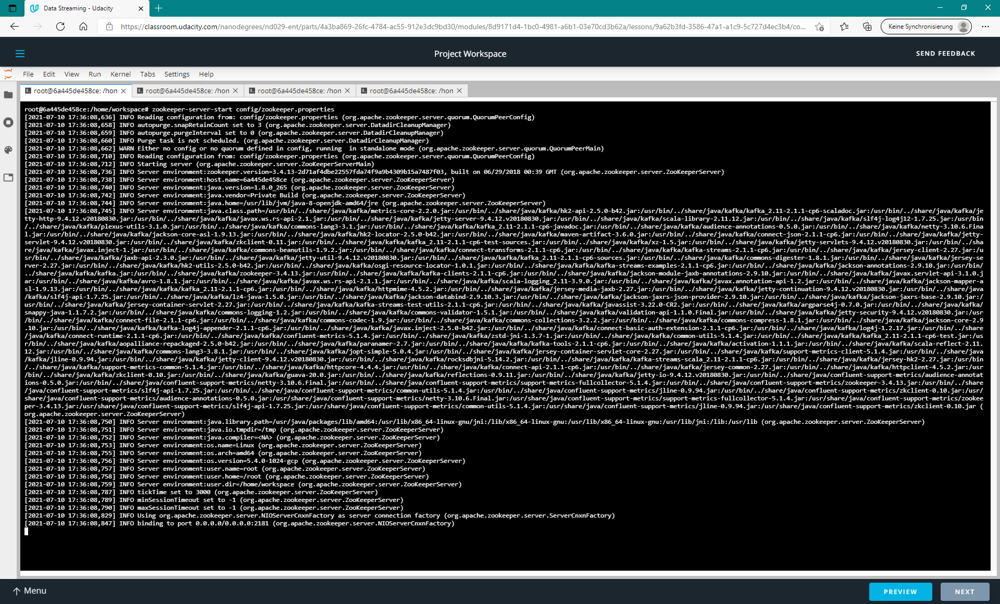
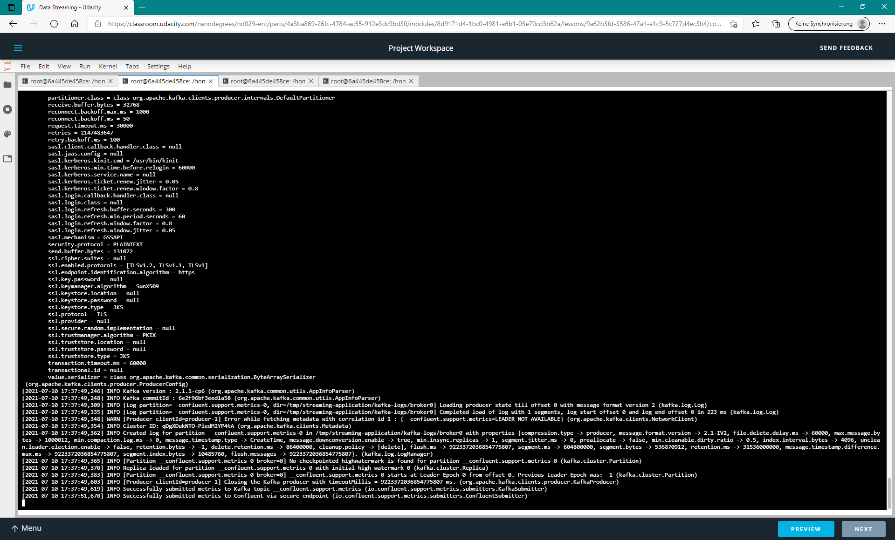
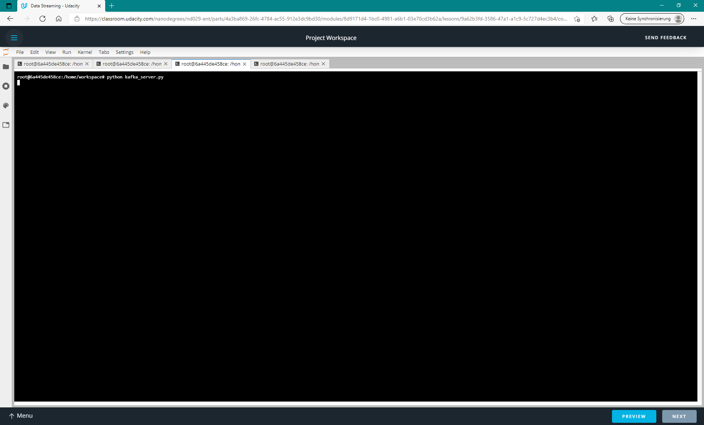
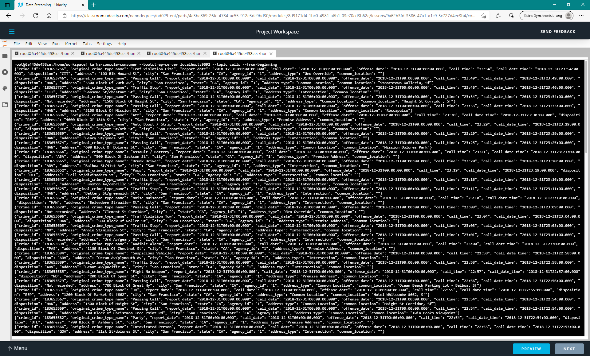
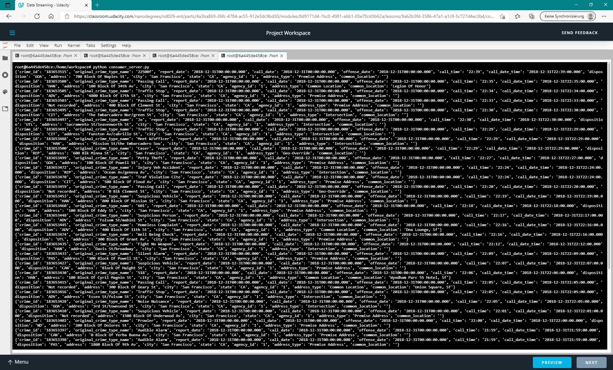
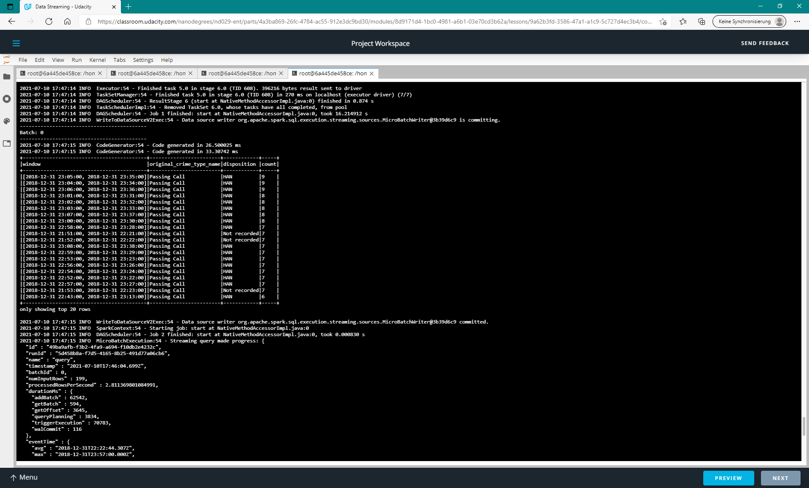
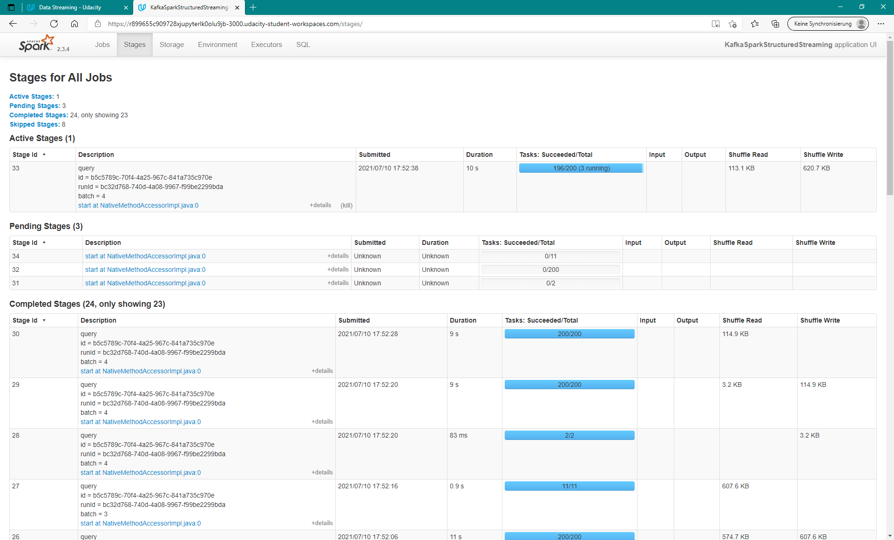

# SF-Crime-Statistics-with-Spark-Streaming


## Instructions

* Start Zookeeper

```bash
zookeeper-server-start config/zookeeper.properties
```



* Start Kafka

```bash
kafka-server-start config/server.properties
```


* Start Kafka Producer

```bash
python kafka_server.py
```


* Check if data is visible in Kafka

Either by using the default 'kafka-console-consumer' provided by Kafka, or the 'console-consumer.py' script provided in this project.

```bash
kafka-console-consumer --bootstrap-server localhost:9092 --topic calls --from-beginning
```



```bash
python console-consumer.py
```



* Run the Spark Streaming Job

Submit the streaming job to the Spark cluster.
```bash
spark-submit --packages org.apache.spark:spark-sql-kafka-0-10_2.11:2.3.4 --master local[*] data_stream.py
```

The console will contain the constantly updated results along with detailled progress reports.




Additional details are visible in the Spark UI.




## Questions and Answers for Performance Optimization

### How did changing values on the SparkSession property parameters affect the throughput and latency of the data?
The Spark Session properties allow to trade-off throughput and latency.
* 'maxOffsetsPerTrigger' rate limits on the maximimum number of offsets processed per trigger interval. The specified maximum Offsets will be evently split acroess all partitions in the topic (see http://spark.apache.org/docs/latest/structured-streaming-kafka-integration.html).
* 'maxRatePerPartition' is the maximum rate (number of records per second) at which data will be read from each Kafka partition when using the new Kafka direct stream API. (see https://spark.apache.org/docs/latest/configuration.html)
Smaller batches will lead to reduced latency and more frequent updates of the job result. 
However, the throughput and efficiency is reduced with shrinking batch sizes as an increasing fraction of the total runtime has to be accounted to computational overhead (e.g. shuffle operations) and limits the speedup achievable by parallelization (Amdahl's law).

### What were the 2-3 most efficient SparkSession property key/value pairs? Through testing multiple variations on values, how can you tell these were the most optimal?
Throughput is measured and contained in the progress report in the field 'processedRowsPerSecond'.
Latency is contained in the 'durationMs' part of the progress report.
The following properties showed quite good results for me:
```bash
.option("maxOffsetPerTrigger", 200) \
.option("maxRatePerPartition", 400) \
```